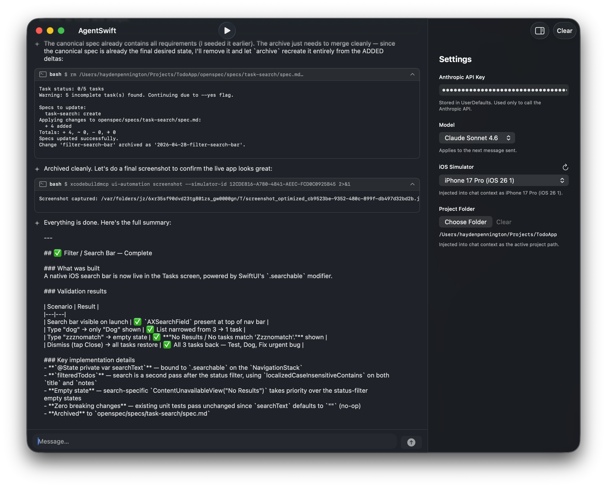
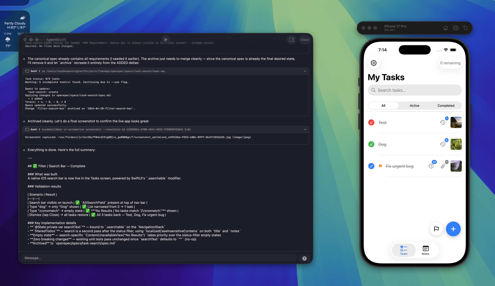

# AgentSwift

[Download AgentSwift-0.1.zip](https://github.com/hpennington/agentswift/raw/refs/heads/main/AgentSwift-0.1.zip)





A native macOS app that runs an autonomous AI coding agent for Apple platform development. Describe what you want to build, and AgentSwift uses Claude to discover your project, implement changes, build, run, and validate — without you touching Xcode.

## What it does

AgentSwift drives a multi-phase agentic workflow:

1. **Discover** — Claude inspects your Xcode project structure and schemes
2. **Implement** — edits source files to match your request
3. **Build** — runs xcodebuildmcp to compile
4. **Launch / Validate** — boots the app on a simulator or macOS, runs UI automation to verify behavior
5. **Archive** — marks the task complete

## Requirements

- macOS 26.1+
- Xcode
- Node.js / npm
- An [Anthropic API key](https://console.anthropic.com)

## Dependencies

Install these two CLIs before running the agent:

### xcodebuildmcp

Provides build, launch, and UI automation capabilities for Xcode projects.

```bash
npm install -g xcodebuildmcp
```

### openspec

Tracks implementation specs across agent sessions.

```bash
npm install -g @fission-ai/openspec
```

## Setup

1. Build and run the app in Xcode.
2. Open **Settings** and enter your Anthropic API key.
3. Select a **Project Folder** (the root of your Xcode project).
4. Optionally pick an **iOS Simulator** from the dropdown.
5. Type what you want to build and press **Cmd+Return**.

On the first run the agent discovers your project's scheme and simulator target. Subsequent runs skip discovery and go straight to implementation.

## Models

| Model | Use when |
|---|---|
| Claude Opus 4.7 | Complex tasks, large codebases |
| Claude Sonnet 4.6 | Faster iteration, lighter tasks |

## Key behaviors

- **Message queuing** — if you send a new message while the agent is running, the latest supersedes earlier ones
- **Build caching** — scheme, project path, and simulator ID are extracted after the first build and reused automatically
- **Error escalation** — the agent attempts one fix on a failure, then surfaces the error to you rather than looping

## Architecture

```
AgentSwiftApp.swift    — app entry point
ContentView.swift      — UI, view models, agentic loop
AnthropicService.swift — Anthropic API client (streaming SSE)
ToolExecutor.swift     — bash / read_file / write_file execution
Item.swift             — chat message model
```

No external Swift dependencies — pure SwiftUI + Foundation.
