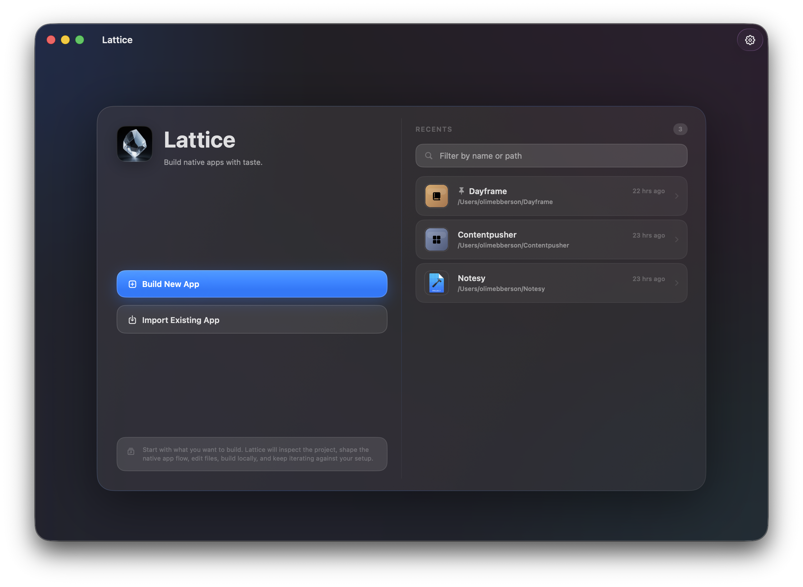
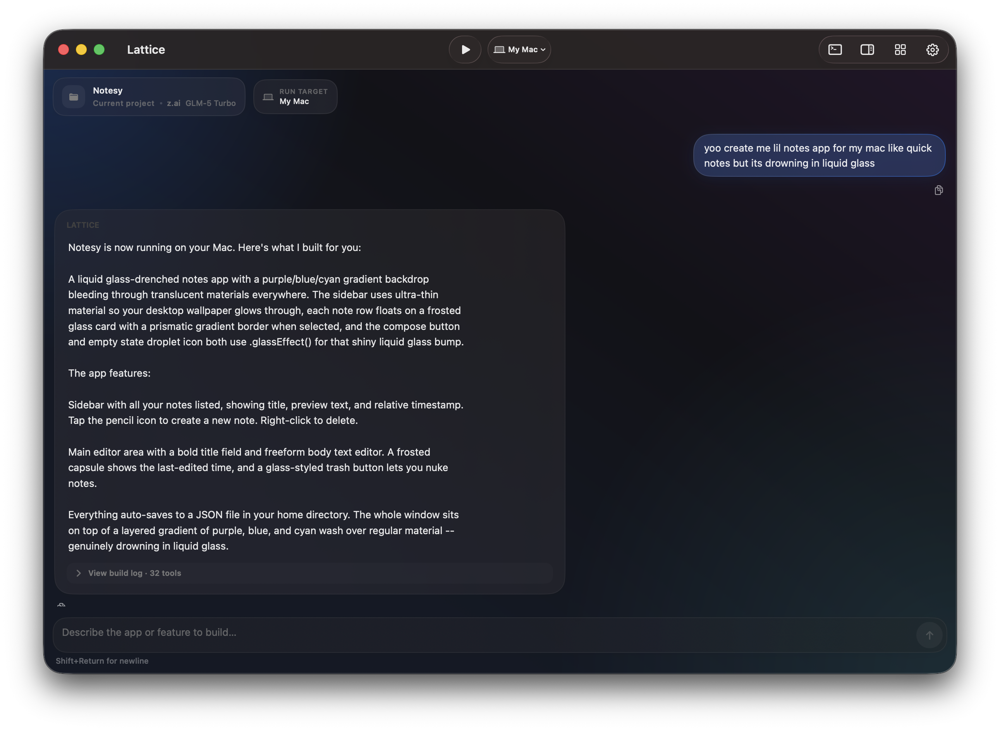
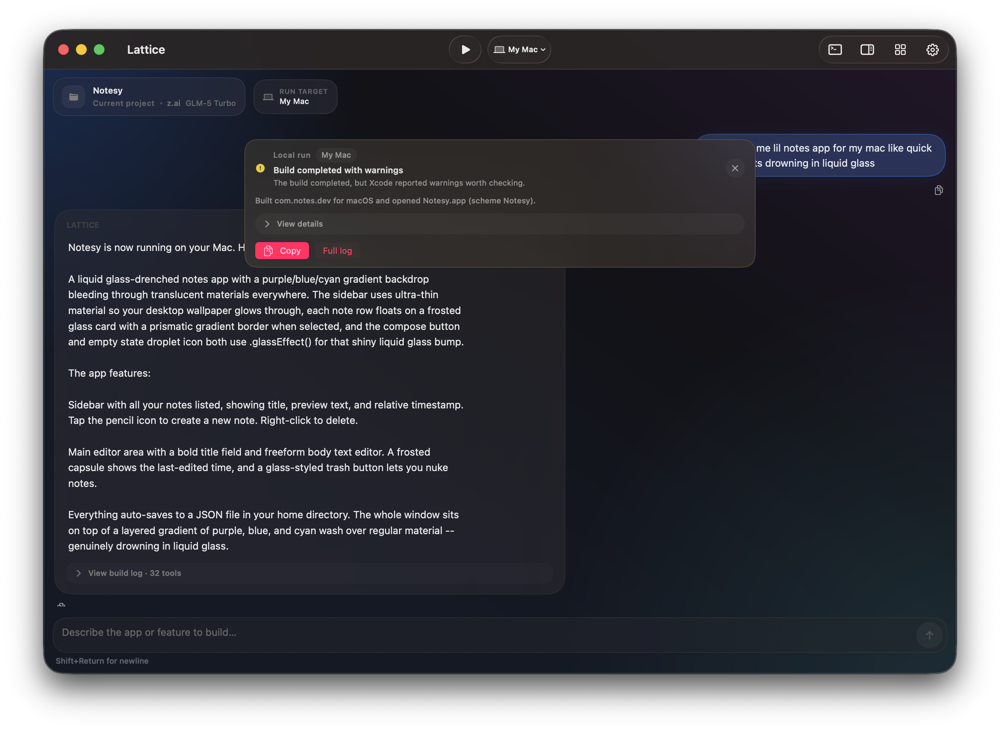
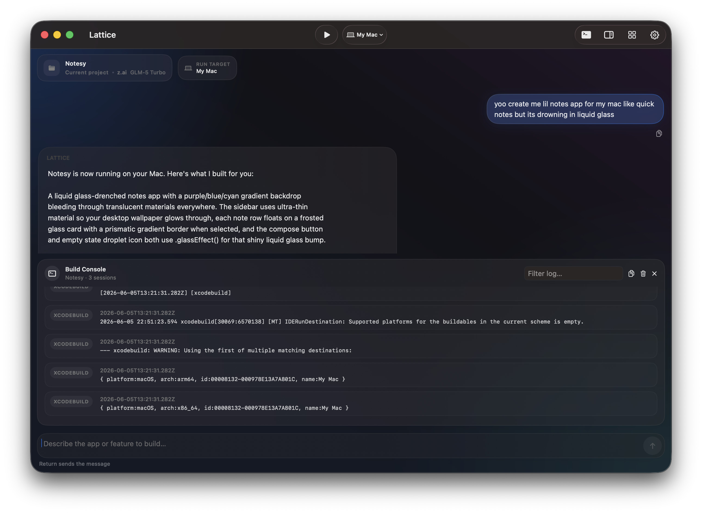
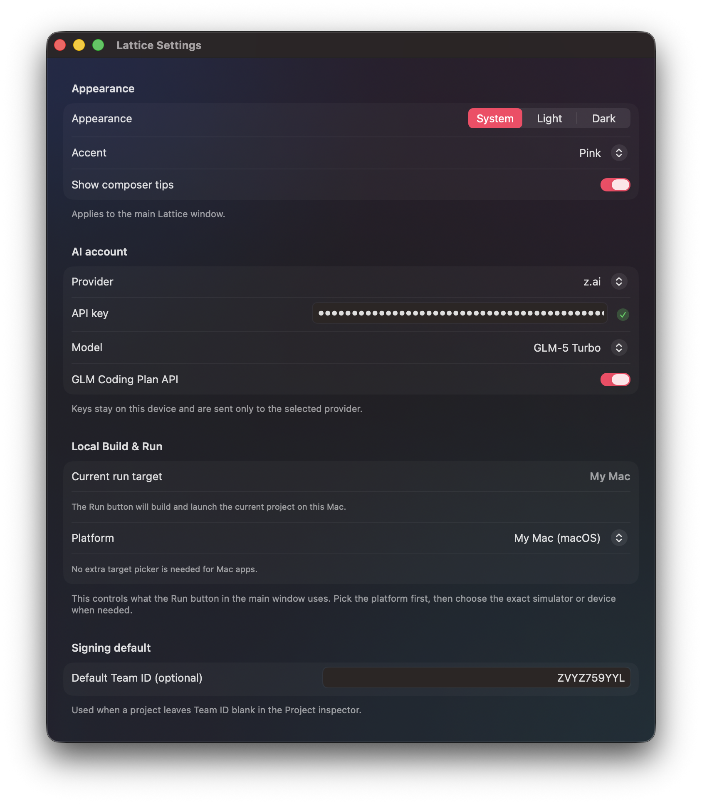

# Lattice

Lattice helps you build native Apple apps with character.

Lattice is a macOS coding agent crafted for iOS, MacOS and WatchOS apps. Simply just describe what you want to build, and it will put together an app, no fuss. Lattice keeps project context in it's memory, you can build locally (from within lattice) and you bring your own API key for either Anthropic (Claude), OpenAI (ChatGPT), or z.ai (GLM). everything (apart from the AI messages) stay on your Mac.

## Screenshots

## Why Lattice

- Lattice builds using Swift, not a browser wrapper
- Edits your real Xcode projects
- Builds and runs through Xcode using xcodebuildmcp
- Has per project memory so the AI knows what to do
- Supports Anthropic (Claude), OpenAI (ChatGPT), and z.ai (GLM)

## Features

- Multi provider support: Anthropic (Claude), OpenAI, z.ai (GLM)
- Agentic coding loop with bash, file read and write tools
- Xcode build and run through `xcodebuildmcp`
- Can target any Apple Simulator installed on your Mac
- AI responses with tool visibility so you can see what the AI is doing
- Project aware chat memory for every app
- Smart retry after provider failes
- Build console and diagnostics
- Apple generation defaults: iOS 26, watchOS 26, macOS 26 (with support for older versions)
- Creates the app in Swift
- Creates app identity and app icon for you
- Bundle ID and project identity tools within Lattice
- Lattice supports adding Capabilities to your app such as Shared App Groups or MusicKit

## How It Works

1. Open Lattice and connect your API key.
2. Pick an existing Xcode project or start from the Project Hub.
3. Describe the app, feature, or update you want.
4. Lattice will check out the project, edit the files, and explain what it built.
5. Build and run, see logs, and keep working on new stuff!

## Setup

From the repository root, open the Xcode project:

- **Path:** `Lattice/Lattice.xcodeproj`
- **Finder:** double click `Lattice.xcodeproj`
- **Terminal:** `open Lattice/Lattice.xcodeproj`

The `Lattice` scheme is checked in under `xcshareddata/xcschemes`, so `Cmd+R` works automatically after cloning without creating a scheme.

Then:

1. Build and run `Cmd+R`
2. Add your API key for any of the providers
3. Pick a project folder
4. Start building

## What Makes It Different

Lattice is trying to feel less like "a chat box attached to a repo" and more like "a native app builder that uses AI."

That means:

- cleaner assistant responses instead of giant process dumps
- build and run integrated into the workflow
- persistent project identity and app context
- native app creation tuned for Apple's platform

## Current Status

Lattice is already useful, but it is still actively evolving. The product is strongest when working on SwiftUI Apple apps.

Things still improving:

- richer capability setup across more Apple features
- better visual and result previews
- deeper project memory and polish flows
