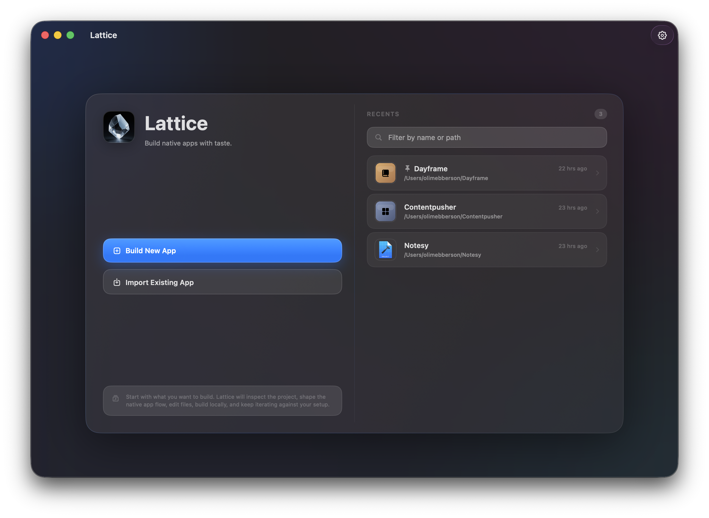
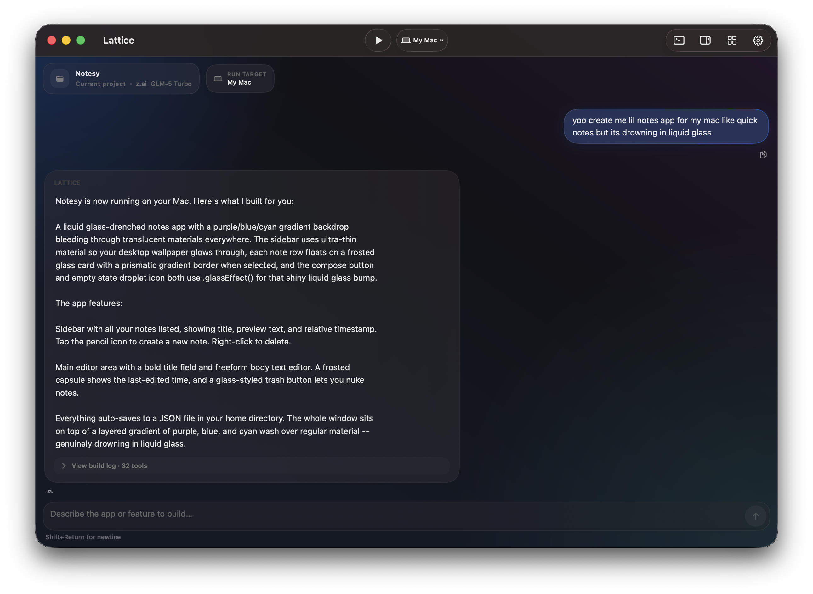
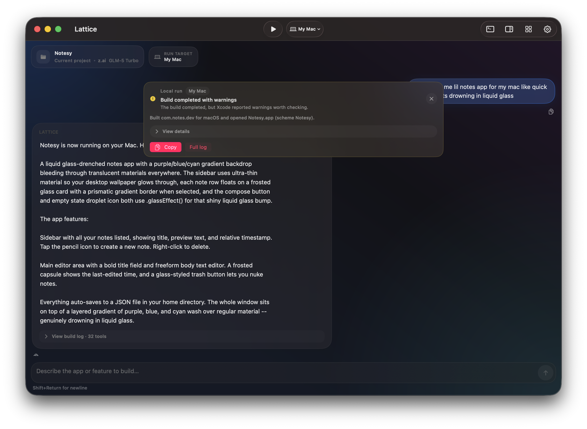
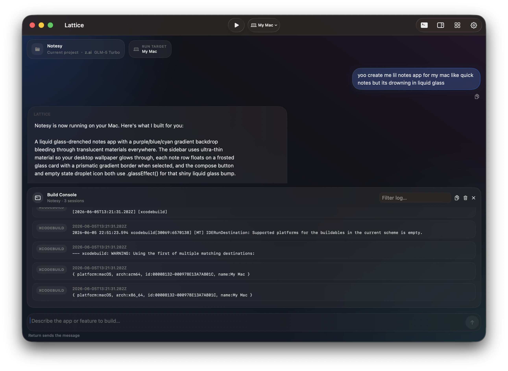
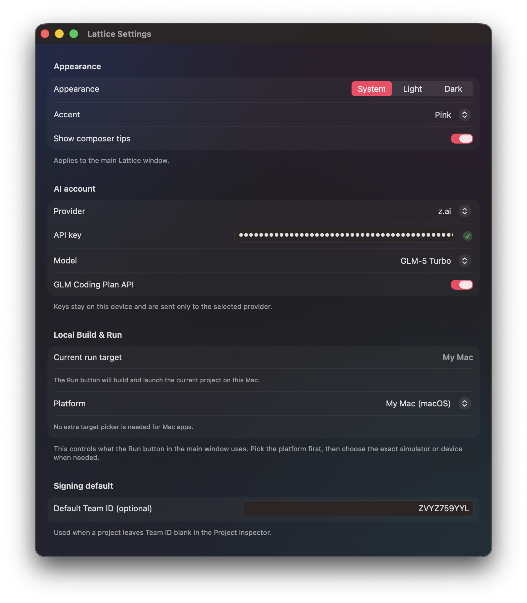

# Lattice

Lattice helps you build native Apple apps with character.

Lattice is a macOS coding agent crafted for iOS, macOS, and watchOS apps. Describe what you want to build, and it puts together a real Xcode project, edits real Swift files, builds and runs on your Mac or a simulator, and can publish to TestFlight — no fuss. Lattice keeps project context in memory, and everything (apart from the AI messages) stays on your Mac.

## Screenshots

## Why Lattice

- Lattice builds using Swift, not a browser wrapper
- Edits your real Xcode projects — open them in Xcode anytime
- Builds and runs through Xcode's own toolchain (`xcodebuild`)
- Optional diff review: approve every file change before it lands
- Per-project memory, git checkpoints, and history restore
- Your keys and your code never leave your Mac (keys live in the Keychain)

## Features

### AI models & providers
- Built-in providers: Anthropic (Claude), OpenAI, z.ai (GLM) — current 2026 model lineups
- Claude subscription support: paste a token from `claude setup-token` and use your Pro/Max plan instead of per-token billing
- Custom providers: any OpenAI-compatible or Anthropic-compatible endpoint, with presets for Ollama, LM Studio, OpenRouter, Groq, DeepSeek, Mistral, and xAI
- Model list fetching, per-provider keys in the Keychain, and first-run onboarding

### Building & shipping
- Build & run on any installed iOS/watchOS simulator, connected devices, or this Mac
- Screenshot feedback loop: capture the running simulator and attach it to chat so the AI can see and fix the UI
- Simulator automation: the agent drives the app like a user (launch, tap, type, swipe, wait) and verifies it actually works, not just that it compiled
- Publish to TestFlight: archive and upload to App Store Connect with an API key, right from the toolbar
- Source control: commit, push, and open pull requests on GitHub (git init happens automatically for new projects)

### Games
- "This is a game" project switch turns on Game Mode: engine choice (SpriteKit 2D, RealityKit/ARKit 3D, SwiftUI-casual, GameplayKit), a real game loop + state machine, game feel (juice: tweens, particles, screen shake, haptics), performance guidance, and art-without-assets
- Lattice auto-detects game projects even mid-build, so an app that becomes a game keeps the right guidance
- `simulator_use` wait + screenshot lets the agent confirm a real-time game is actually moving

### Apple capabilities
Structured, idempotent capability support through chat or the Identity editor (13 total):
- App Groups, Push Notifications, StoreKit, Keychain Sharing, Background Modes
- SwiftData (local database, with a starter `@Model`) and iCloud Sync (CloudKit)
- HealthKit and App Intents (Siri, Shortcuts, Spotlight)
- Home Screen Widgets (real WidgetKit extension target) and Live Activities
- Game Center (leaderboards/achievements) and AR (camera / RealityKit)

### Agent experience
- Agentic coding loop with bash, file read/write, web search, and web fetch tools
- Tool visibility so you can see what the AI is doing, plus a build console
- Diff review before file writes (toggle in Settings), with Apply/Decline
- Git checkpoints with safe restore — every turn can be rewound
- Per-turn token usage display

## How It Works

1. Open Lattice and connect your AI (key, subscription token, or local model).
2. Pick an existing Xcode project or start from the Project Hub.
3. Describe the app, feature, or update you want.
4. Lattice checks out the project, edits the files, and explains what it built.
5. Build and run, iterate with screenshots, then publish to TestFlight.

## Setup

From the repository root, open the Xcode project:

- **Path:** `Lattice/Lattice.xcodeproj`
- **Finder:** double click `Lattice.xcodeproj`
- **Terminal:** `open Lattice/Lattice.xcodeproj`

The `Lattice` scheme is checked in under `xcshareddata/xcschemes`, so `Cmd+R` works automatically after cloning without creating a scheme.

Then:

1. Build and run (`Cmd+R`)
2. Connect your AI in onboarding or Settings
3. Pick a project folder
4. Start building

## What Makes It Different

Lattice is trying to feel less like "a chat box attached to a repo" and more like "a native app builder that uses AI."

That means:

- cleaner assistant responses instead of giant process dumps
- build, run, screenshots, source control, and publishing integrated into one workflow
- persistent project identity and app context
- native app creation tuned for Apple's platforms

## Current Status

Lattice is already useful, and it is still actively evolving. It is strongest on SwiftUI apps and (with Game Mode) on native SpriteKit/RealityKit games.

Things still improving:

- watchOS complications and more Lock Screen / Live Activity surface polish
- richer in-game art and audio asset pipelines
- keeping the model catalog current as providers ship new models
- ongoing visual polish and preview improvements
